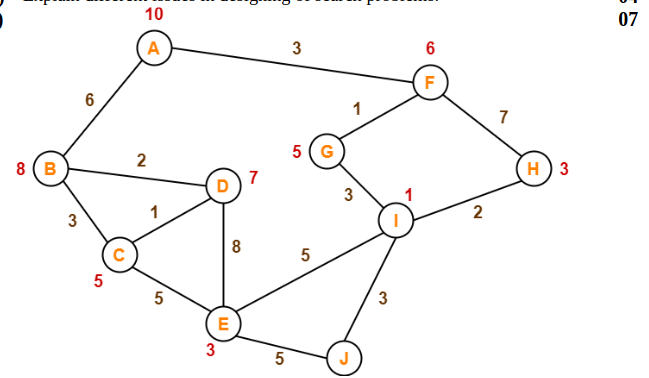

# Summer 2024 - Artificial Intelligence Solutions

## Q.1 (a) What is Turing test? [03]

=> **Turing Test** was proposed by Alan Turing to check whether a machine can show intelligent behaviour like a human.

### Idea

1. A human judge communicates with a human and a machine through text.
2. The judge asks questions to both.
3. If the judge cannot reliably identify which one is the machine, the machine is considered intelligent.

### Capabilities required

1. Natural language processing
2. Knowledge representation
3. Reasoning
4. Learning

## Q.1 (b) Difference between procedural and declarative knowledge. [04]

| Procedural knowledge | Declarative knowledge |
|---|---|
| It tells how to perform a task. | It tells what is true about the world. |
| It is action or process oriented. | It is fact or statement oriented. |
| It is difficult to modify independently. | It is easier to add or modify facts. |
| Example: steps to solve a puzzle. | Example: "All humans are mortal." |

=> Procedural knowledge is useful for algorithms, while declarative knowledge is useful for reasoning systems.

## Q.1 (c) What is artificial intelligence? Define the different task domains of artificial intelligence. [07]

=> **Artificial Intelligence** is a branch of computer science that creates systems capable of performing tasks that normally require human intelligence.

### AI includes

1. Learning from experience
2. Reasoning and problem solving
3. Understanding language
4. Planning actions
5. Recognizing objects, speech and patterns

### Task domains of AI

#### 1. Mundane tasks

=> These are common tasks performed by humans in daily life.

Examples:

1. Vision
2. Speech understanding
3. Natural language processing
4. Robot movement

#### 2. Formal tasks

=> These tasks have well-defined rules and formal structure.

Examples:

1. Game playing
2. Theorem proving
3. Mathematical problem solving

#### 3. Expert tasks

=> These tasks require specialized expert knowledge.

Examples:

1. Medical diagnosis
2. Engineering design
3. Fault detection
4. Financial decision making

## Q.2 (a) Define term: Plateau, ridge. [03]

1. **Plateau**

=> A plateau is a flat region in the search space where neighboring states have the same heuristic value.

=> Hill climbing cannot decide which move is better.

2. **Ridge**

=> A ridge is a narrow path toward the goal where direct movement does not immediately improve the heuristic value.

=> The algorithm may need sideways or indirect moves.

## Q.2 (b) Explain different issues in designing of search problems. [04]

### Important issues

1. **Direction of search**

=> Decide whether to search forward from initial state or backward from goal state.

2. **Search strategy**

=> Choose BFS, DFS, best-first, A*, hill climbing, etc.

3. **Use of heuristic knowledge**

=> A good heuristic reduces unnecessary search.

4. **Avoiding repeated states**

=> Repeated states waste time and may create loops.

5. **Completeness and optimality**

=> The search should find a solution if it exists and preferably find the best solution.

## Q.2 (c) Find the most cost-effective path from A to J using A* Algorithm. [07]



=> A* uses:

```text
f(n) = g(n) + h(n)
```

Where `g(n)` is actual cost from start and `h(n)` is heuristic cost to goal.

### Given heuristic values

| Node | h(n) |
|---|---:|
| A | 10 |
| B | 8 |
| C | 5 |
| D | 7 |
| E | 3 |
| F | 6 |
| G | 5 |
| H | 3 |
| I | 1 |
| J | 0 |

### A* calculation

Start at A:

| Path | g(n) | h(n) | f(n) |
|---|---:|---:|---:|
| A-B | 6 | 8 | 14 |
| A-F | 3 | 6 | 9 |

Select `F` because it has minimum `f`.

From F:

| Path | g(n) | h(n) | f(n) |
|---|---:|---:|---:|
| A-F-G | 4 | 5 | 9 |
| A-F-H | 10 | 3 | 13 |

Select `G`.

From G:

| Path | g(n) | h(n) | f(n) |
|---|---:|---:|---:|
| A-F-G-I | 7 | 1 | 8 |

Select `I`.

From I:

| Path | g(n) | h(n) | f(n) |
|---|---:|---:|---:|
| A-F-G-I-J | 10 | 0 | 10 |
| A-F-G-I-H | 9 | 3 | 12 |
| A-F-G-I-E | 12 | 3 | 15 |

Goal `J` is reached.

### Final answer

```text
A -> F -> G -> I -> J
```

Total cost:

```text
3 + 1 + 3 + 3 = 10
```

=> Most cost-effective path is **A-F-G-I-J** with cost **10**.

## Q.2 (c) OR Translate sentences to predicate logic and prove "Scrooge is not a child." [07]

### Predicates

```text
Child(x): x is a child
Loves(x, y): x loves y
Reindeer(x): x is a reindeer
RedNose(x): x has a red nose
Weird(x): x is weird
Clown(x): x is a clown
```

### Predicate logic

1. Every child loves Santa.

```text
forall x Child(x) -> Loves(x, Santa)
```

2. Everyone who loves Santa loves any reindeer.

```text
forall x forall y (Loves(x, Santa) and Reindeer(y)) -> Loves(x, y)
```

3. Rudolph is a reindeer and Rudolph has a red nose.

```text
Reindeer(Rudolph) and RedNose(Rudolph)
```

4. Anything which has a red nose is weird or is a clown.

```text
forall x RedNose(x) -> (Weird(x) or Clown(x))
```

5. No reindeer is a clown.

```text
forall x Reindeer(x) -> not Clown(x)
```

6. Scrooge does not love anything which is weird.

```text
forall x Weird(x) -> not Loves(Scrooge, x)
```

### Proof

1. `Reindeer(Rudolph)` and `RedNose(Rudolph)`.
2. From red nose rule: `Weird(Rudolph) or Clown(Rudolph)`.
3. From no reindeer is clown and `Reindeer(Rudolph)`: `not Clown(Rudolph)`.
4. Therefore, `Weird(Rudolph)`.
5. Scrooge does not love weird things, so `not Loves(Scrooge, Rudolph)`.
6. Assume `Child(Scrooge)`.
7. Every child loves Santa, so `Loves(Scrooge, Santa)`.
8. Everyone who loves Santa loves every reindeer. Rudolph is a reindeer, so `Loves(Scrooge, Rudolph)`.
9. This contradicts `not Loves(Scrooge, Rudolph)`.

=> Therefore, the assumption is false.

```text
not Child(Scrooge)
```

## Q.3 (a) Explain Wumpus world problem. [03]

=> **Wumpus World** is a classic AI problem used to explain knowledge-based agents.

### Environment

1. It is a grid of rooms.
2. Some rooms contain pits.
3. One room contains a Wumpus.
4. One room contains gold.
5. The agent must find gold and return safely.

### Percepts

1. Breeze near a pit
2. Stench near Wumpus
3. Glitter near gold
4. Bump near wall
5. Scream when Wumpus dies

=> The agent uses logic to infer safe rooms and avoid danger.

## Q.3 (b) Differentiate Generate and Test algorithm with Best First Search algorithm. [04]

| Generate and Test | Best First Search |
|---|---|
| Generates possible solutions and tests them. | Expands the most promising node first. |
| May be blind if no heuristic is used. | Uses heuristic value to guide search. |
| Usually less efficient for large spaces. | More efficient when heuristic is good. |
| Does not maintain priority queue necessarily. | Uses OPEN list or priority queue. |
| Example: try possible passwords. | Example: route finding using estimated distance. |

## Q.3 (c) What is knowledge base agent in AI? Discuss architecture of AI. [07]

=> A **knowledge-based agent** is an intelligent agent that stores knowledge about the world and uses reasoning to select actions.

### Main components

1. **Knowledge base**

=> Stores facts and rules.

2. **Inference engine**

=> Derives new facts from existing knowledge.

3. **Percepts**

=> Information received from environment.

4. **Actions**

=> Operations performed by the agent.

5. **TELL operation**

=> Adds new knowledge to the knowledge base.

6. **ASK operation**

=> Queries the knowledge base to decide an action.

### Architecture

```text
Environment -> Sensors -> Percepts -> Knowledge Base
                                      |
                                      v
                               Inference Engine
                                      |
                                      v
Environment <- Actuators <- Actions <- Decision
```

### Working

1. Agent perceives the environment.
2. It updates the knowledge base using `TELL`.
3. It asks the knowledge base what action should be taken.
4. Inference engine derives the best action.
5. Agent performs the action.

## Q.3 (a) OR Convert the logical statement to conjunctive normal form. [03]

### Predicate logic form

1. Ravi likes all kinds of food.

```text
forall x Food(x) -> Likes(Ravi, x)
```

2. Apples and chicken are food.

```text
Food(Apple)
Food(Chicken)
```

3. Anything anyone eats and is not killed is food.

```text
forall x forall y (Eats(x, y) and not KilledBy(x, y)) -> Food(y)
```

### CNF clauses

```text
not Food(x) or Likes(Ravi, x)
Food(Apple)
Food(Chicken)
not Eats(x, y) or KilledBy(x, y) or Food(y)
```

## Q.3 (b) OR Discuss the different approaches to knowledge representation. [04]

### Approaches

1. **Simple relational knowledge**

=> Facts are represented as relations.

Example: `Student(Aman)`, `Teaches(John, AI)`.

2. **Inheritable knowledge**

=> Properties are inherited through hierarchy.

Example: Dog is an animal, so dog inherits animal properties.

3. **Inferential knowledge**

=> New facts are derived using logic and rules.

Example: `Human(x) -> Mortal(x)`.

4. **Procedural knowledge**

=> Knowledge is represented as procedures or steps.

Example: steps to diagnose a disease.

## Q.3 (c) OR If USA + USSR = PEACE. Find P + E + A + C + E. [07]

=> This is a crypt-arithmetic problem. Each letter has a unique digit.

```text
   U S A
+ U S S R
---------
 P E A C E
```

Column-wise:

1. The result has 5 digits, so carry into the leftmost column makes `P = 1`.
2. Assign different digits to all letters.
3. Use column addition with carries from right to left.

One valid solution is:

```text
U = 9, S = 3, A = 2, R = 8, P = 1, E = 0, C = 7
```

Verification:

```text
  932
+9338
-----
10270
```

Thus:

```text
P + E + A + C + E = 1 + 0 + 2 + 7 + 0 = 10
```

## Q.4 (a) Explain Hierarchical Planning. [03]

=> **Hierarchical planning** solves a problem by dividing a high-level goal into smaller subgoals.

### Example

Goal: Travel to college.

High-level plan:

```text
Travel to college
```

Subtasks:

```text
Get ready -> Reach bus stop -> Take bus -> Enter college
```

### Advantages

1. Reduces complexity.
2. Makes planning easier.
3. Supports planning at different abstraction levels.

## Q.4 (b) What is goal stack planning? Give example of initial state and goal state. [04]

=> **Goal stack planning** is a planning method that uses a stack to store goals, subgoals and actions.

### Working

1. Push goal on stack.
2. If goal is not true, push an action that can achieve it.
3. Push preconditions of that action.
4. When preconditions are satisfied, apply the action.

### Blocks world example

Initial state:

```text
On(A, Table)
On(B, Table)
Clear(A)
Clear(B)
HandEmpty
```

Goal state:

```text
On(A, B)
```

Action:

```text
Stack(A, B)
```

Preconditions:

```text
Holding(A)
Clear(B)
```

## Q.4 (c) Explain the state space search with the use of 8 Puzzle Problem. [07]

=> **State space search** represents a problem as states and operators. The solution is a path from initial state to goal state.

### 8-puzzle problem

The 8-puzzle has 8 numbered tiles and one blank space in a 3 x 3 board.

### State representation

Each arrangement of tiles is a state.

Example:

```text
Initial state        Goal state
1 2 3                1 2 3
4 _ 6                4 5 6
7 5 8                7 8 _
```

### Operators

The blank tile can move:

1. Up
2. Down
3. Left
4. Right

### State space search

```text
Initial State
   |
Apply legal blank moves
   |
Generate new states
   |
Test for goal
   |
Continue until goal is found
```

### Search tree

```text
        Initial
      /    |    \
   MoveU MoveD MoveL ...
     |
 New state
```

### Heuristics

1. Number of misplaced tiles
2. Manhattan distance

=> Search algorithms such as BFS, DFS and A* can be used to solve the 8-puzzle.

## Q.4 (a) OR Describe the axioms of probability theory. [03]

### Axiom 1: Non-negativity

```text
P(A) >= 0
```

=> Probability of any event cannot be negative.

### Axiom 2: Normalization

```text
P(True) = 1
```

=> Probability of a certain event is 1.

### Axiom 3: Additivity

If A and B are mutually exclusive:

```text
P(A or B) = P(A) + P(B)
```

## Q.4 (b) OR Perform the unification of atomic sentences. [04]

### 1. `p(b, X, f(g(Z)))` and `p(Z, f(Y), f(Y))`

Compare arguments:

```text
b = Z        => Z/b
X = f(Y)     => X/f(Y)
f(g(Z)) = f(Y) => Y = g(Z)
```

Since `Z = b`, then:

```text
Y = g(b)
X = f(g(b))
```

### MGU

```text
{ Z/b, Y/g(b), X/f(g(b)) }
```

### 2. `test(11)` and `test(y)`

```text
y = 11
```

### MGU

```text
{ y/11 }
```

## Q.4 (c) OR What is production system? Explain it with an example. Discuss characteristics. [07]

=> A **production system** is a rule-based system used for problem solving in AI.

### Components

1. **Set of production rules**

```text
IF condition THEN action
```

2. **Working memory**

=> Stores current facts or state.

3. **Control strategy**

=> Selects which rule to apply.

4. **Rule interpreter**

=> Matches rules and executes actions.

### Example

```text
IF fever and cough THEN possible_flu
IF possible_flu and body_pain THEN consult_doctor
```

If working memory contains:

```text
fever, cough, body_pain
```

Then the system derives:

```text
possible_flu, consult_doctor
```

### Characteristics

1. **Monotonic / non-monotonic**
2. **Partially commutative**
3. **Deterministic / non-deterministic**
4. **Rule-based and modular**
5. **Uses recognize-act cycle**

## Q.5 (a) Explain Alpha-Beta Cut-off method. [03]

=> **Alpha-beta cut-off** is an optimization of the minimax algorithm.

### Meaning

1. `Alpha` is the best value found so far for MAX.
2. `Beta` is the best value found so far for MIN.
3. If `alpha >= beta`, remaining branches are pruned.

=> It gives the same result as minimax but explores fewer nodes.

## Q.5 (b) Discuss application of statistical learning in AI. [04]

### Applications

1. **Classification**

=> Classifies emails as spam or not spam.

2. **Prediction**

=> Predicts stock price, weather or sales.

3. **Medical diagnosis**

=> Learns disease patterns from patient data.

4. **Speech and image recognition**

=> Recognizes spoken words, faces and objects.

5. **Natural language processing**

=> Used in translation, sentiment analysis and text classification.

## Q.5 (c) Explain minimax procedure for game playing with example. [07]

=> **Minimax** is a decision-making algorithm used in two-player games.

### Assumptions

1. Two players: MAX and MIN.
2. MAX tries to maximize score.
3. MIN tries to minimize score.
4. Both players play optimally.

### Algorithm

```text
1. Generate game tree up to terminal states.
2. Assign utility values to terminal states.
3. At MAX level, choose maximum value.
4. At MIN level, choose minimum value.
5. Select the move with best minimax value.
```

### Example

```text
          MAX
        /     \
      MIN     MIN
     /  \     /  \
    3    5   2    9
```

MIN level:

```text
min(3,5) = 3
min(2,9) = 2
```

MAX level:

```text
max(3,2) = 3
```

=> MAX chooses the left branch.

## Q.5 (a) OR Convert `P <-> (Q V R)` to conjunctive normal form. [03]

```text
P <-> (Q or R)
```

Remove biconditional:

```text
(P -> (Q or R)) and ((Q or R) -> P)
```

Remove implication:

```text
(not P or Q or R) and (not(Q or R) or P)
```

Apply De Morgan:

```text
(not P or Q or R) and ((not Q and not R) or P)
```

Distribute OR over AND:

```text
(not P or Q or R) and (P or not Q) and (P or not R)
```

=> CNF is:

```text
(not P or Q or R) and (P or not Q) and (P or not R)
```

## Q.5 (b) OR Discuss Bayesian network and its applications. [04]

=> A **Bayesian network** is a probabilistic graphical model that represents random variables and their conditional dependencies using a directed acyclic graph.

### Components

1. Nodes represent random variables.
2. Directed edges represent dependency.
3. Each node has a conditional probability table.

### Applications

1. Medical diagnosis
2. Fault detection
3. Spam filtering
4. Weather prediction
5. Risk analysis

## Q.5 (c) OR Write Prolog programs. [07]

### 1. Greatest among three variables

```prolog
greatest(A, B, C, A) :-
    A >= B,
    A >= C.

greatest(A, B, C, B) :-
    B >= A,
    B >= C.

greatest(A, B, C, C) :-
    C >= A,
    C >= B.
```

Query:

```prolog
?- greatest(10, 25, 15, X).
X = 25.
```

### 2. Count odd and even elements from a list

```prolog
count_odd_even([], 0, 0).

count_odd_even([H|T], Odd, Even) :-
    0 is H mod 2,
    count_odd_even(T, Odd, E1),
    Even is E1 + 1.

count_odd_even([H|T], Odd, Even) :-
    1 is H mod 2,
    count_odd_even(T, O1, Even),
    Odd is O1 + 1.
```

Query:

```prolog
?- count_odd_even([1,2,3,4,5], O, E).
O = 3,
E = 2.
```
