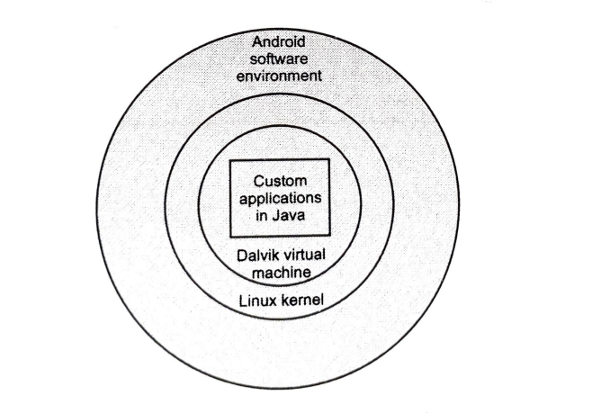
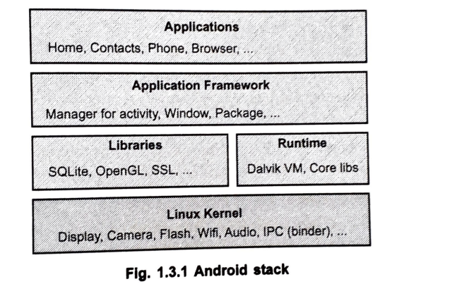

**1 Overview of Android**

**1.1 Introduction to Android**

=> Definition: Android is an open-source software development platform used for creating mobile applications.

=> It is based on an open-source software stack.

Types of software stack components

1. Operating system: A Linux operating system kernel that provides a low-level interface with hardware, memory management, and process control.
2. Middleware: A runtime environment used to execute Android applications.
3. Key mobile applications: Built-in applications such as Email, SMS, PIM, web browser, etc.
4. API libraries for writing mobile applications: Includes various open-source libraries like SQLite, WebKit, and OpenGL ES.

=> The components of the underlying OS are written in C or C++, whereas both user applications and built-in applications are written in Java.

=> An important feature of the Android platform is that there is absolutely no difference between the built-in applications and the applications created with the Software Development Kit (SDK).

=> Android itself is only a software, but by leveraging its Linux kernel to interface with hardware, it can run on many different devices manufactured by multiple cell phone manufacturers.

**1.1.1 Advantages and Disadvantages of Android**

Advantages

1. Supports 2D, 3D graphics: It easily supports various multimedia platforms like 2D and 3D.
2. Supports multiple languages: Android natively supports different languages.
3. Java support: The Java supporting feature enables developers to enhance and add more features.
4. Faster web browser: It easily loads multimedia, making the web browsing experience much faster.
5. Supports MP4, 3GP, MPEG4, MIDI: It supports different types of multimedia formats directly, eliminating the need to convert from one format to another.
6. Video calling: Faster data connections enable users to perform video calls.
7. Open source framework: The open-source nature means users can create their own applications and modify existing code.
8. Uses of tools are very simple: The development tools provided are highly user-friendly.
9. Social networking integration: It provides the freedom to customize applications and features using user-enabled development.
10. Better notification system: It allows users to conveniently check important notifications directly from the dashboard.
11. Low chance of crashing: The Android OS is very smooth and easy to operate with significantly fewer chances of crashing down.
12. Stability: Stability and security are better than other mobile operating systems because it is built upon the robust Linux Kernel.

Disadvantages

1. Slow response: Compared to Apple's iOS or Microsoft's Windows, the response of Android is observed to be slower when opening the same apps across different platforms.
2. Heat: Android makes highly efficient use of processes, which forces the processor to generate heat, especially during long operations and at low battery levels.
3. Advertisement: Users often encounter multiple ads during application use because anyone can insert ad logic into the app program, potentially interfering with the phone's information.

**1.2 Android APIs**

=> Android offers a vast number of APIs for developing applications, ensuring all Android devices support at least these core APIs.

Types of core APIs

1. android.util: The core utility package containing low-level classes like specialized containers, string formatters, and XML parsing utilities.
2. android.os: The operating system package providing access to basic OS services like message passing, interprocess communication, clock functions, and debugging.
3. android.graphics: The graphics API that supplies low-level graphics classes supporting canvases, colors, and drawing primitives.
4. android.text: The text processing tools used for displaying and parsing text.
5. android.database: Supplies the low-level classes required for handling cursors when working with databases.
6. android.content: The content API used to manage data access and publishing by providing services for dealing with resources, content providers, and packages.
7. android.view: The core user interface class where all user interface elements are constructed using a series of Views for user interaction components.
8. android.widget: Built on the View package, these are ready-to-use user-interface elements like lists, buttons, and layouts.
9. com.google.android.maps: A high-level API providing access to native map controls, including the MapView, Overlay, and MapController classes.
10. android.app: A high-level package providing access to the application model, including the Activity and Service APIs that form the basis for all Android applications.
11. android.provider: Offers classes to provide developer access to standard databases (such as the contacts database) included in all Android distributions.
12. android.telephony: Telephony APIs that grant the ability to directly interact with the device's phone stack for making calls, receiving calls, and monitoring SMS messages.
13. android.webkit: The WebKit package featuring APIs for working with web-based content, including a WebView control for embedding browsers.

**1.3 Android Architecture**

=> The Android stack consists of different software layers.

Types of layers in the Android stack

1. Linux kernel layer.
2. Native layer.
3. Application framework layer.
4. Applications layer.

**1. The Linux kernel layer**

=> The Linux kernel includes drivers for hardware, networking, file system access, and inter-process communication.

=> It is positioned at the absolute bottom of the Android stack.

=> It never directly interacts with users or developers, but serves as the heart of the whole system.

Types of functions provided by the Linux kernel

1. Hardware abstraction.
2. Memory management programs.
3. Security settings.
4. Power management software.
5. Other hardware drivers.
6. Support for shared libraries.
7. Network stack.

**2. Native code libraries layer**

=> The next layer in the Android architecture includes Android's native libraries, which carry instructions to guide the device in handling different data types.

=> These native libraries include daemons and services written in C or C++.

=> They provide browser technology from WebKit, database support via SQLite, and advanced graphics/media support.

=> Android Runtime: The runtime environments are written in Java and executed in Dalvik.

=> The core Java packages provide a full-featured Java programming environment.

=> Dalvik is open-source software responsible for running apps on Android devices.

**3. Application framework layer**

=> An important block of the application framework is the application manager.

=> The application managers include windows, contents, activities, telephony, location, and notifications.

**4. Application layer**

=> Applications are located at the topmost layer of the Android stack.

=> An average user of the Android device mostly interacts with this topmost layer for basic functions.

=> The layers further down the stack are accessed mostly by developers and programmers.

Types of standard applications installed with every device

1. SMS client app.
2. Dialer.
3. Web browser.
4. Contact manager.

**1.4 Android Application Framework**

=> Definition: The application framework provides the specific classes used to create Android applications.

=> It provides a generic abstraction for hardware access and actively manages the user interface and application resources.

=> The application framework provides everything necessary to implement an average application.

Types of key application lifecycle components

1. Activity Manager: Controls all aspects of the application lifecycle and activity stack.
2. Content Providers: Allows applications to securely publish and share data with other applications.
3. Resource Manager: Provides access to non-code embedded resources such as strings, color settings, and user interface layouts.
4. Notifications Manager: Allows applications to display alerts and notifications to the user.
5. View System: An extensible set of views used strictly to create application user interfaces.

=> The framework includes traditional programming constructs like threads, processes, and specially designed data structures for mobile applications.

=> Developers can rely on familiar class libraries such as java.net and java.text, along with specialty libraries for graphics and databases.

=> Android applications can interact with the operating system and underlying hardware using a collection of managers, each responsible for keeping the state of a system service.

=> The ViewManager and WindowManager handle user interface fundamentals.

=> Built-in applications such as the Contact manager act as content providers, allowing third-party apps unlimited access to contact data.

**1.5 Android Application Components**

=> Application components are the essential building blocks of an Android application.

=> These components are loosely coupled by the application manifest file that describes each component and how they interact.

Types of main components in an application

1. Activities: They dictate the UI and handle the user interaction to the smart phone screen.
2. Services: They handle background processing associated with an application.
3. Broadcast Receivers: They strictly handle communication between the Android OS and applications.
4. Content Providers: They handle complex data and database management issues.

**1.5.1 Manifest File**

=> Every application must possess an AndroidManifest.xml file precisely named in its root directory.

=> The manifest presents essential information about the application to the Android system before the code can run.

=> It names the Java package for the application, serving as a unique identifier.

=> It strictly describes the components of the application (activities, services, broadcast receivers, content providers) and publishes their capabilities.

=> It actively determines which processes will host application components.

=> It declares the exact permissions the application must have to access protected parts of the API.

=> It also declares the permissions that other applications must have to interact with its components.

=> It temporarily lists Instrumentation classes that provide profiling data while running, which are removed before publishing.

=> It strongly declares the minimum required level of the Android API for the application.

=> It meticulously lists the libraries that the application must be linked against.

**1.5.2 Downloading and Installing Android**

=> To write Android applications, a developer must configure the programming environment for Java development.

=> The required software is available online for download at zero cost.

=> Development can be actively performed on Windows, Macintosh, or Linux computer systems.

Steps for required software installation

1. Download and install The Java Development Kit (JDK) Version 5 or 6.
2. Download and install a compatible Java IDE such as Eclipse along with its JDT plug-in.
3. Download the Android SDK, tools, and documentation.
4. Install the Android Development Tools (ADT) plug-in for Eclipse through the software update mechanism.

=> The Android SDK fundamentally comes with five major components: SDK License Agreement, Android Documentation, Application Framework, Tools, and Sample Applications.

**1.6 Exploring the Development Environment**

=> Developers have multiple choices when selecting integrated development environments (IDEs).

=> The majority of developers choose the popular and freely available Eclipse IDE to design applications.

=> There is a dedicated Android plug-in available strictly for facilitating Android development within Eclipse.

Types of supported operating systems for development

1. Windows XP (32-bit) or Vista (32-bit or 64-bit).
2. Mac OS X 10.5.8 or later (x86 only).
3. Linux (tested on Linux Ubuntu 8.04 LTS, Hardy Heron).

=> Developers are absolutely not constrained to using Eclipse and can choose other IDEs.

**1.7 Android Developing Tools**

**Android SDK**

=> The Android Software Development Kit contains the necessary tools to create, compile, and package Android applications.

=> Most of these essential development tools are entirely command-line based.

=> The primary method to develop applications relies heavily on the Java programming language.

=> The SDK can be freely and easily downloaded directly from the Android website.

**Android Debug Bridge (ADB)**

=> The SDK contains the Android Debug Bridge, which securely connects a virtual or real Android device to the environment.

=> This tool is utilized for the primary purpose of managing the device or debugging the active application.

**Android Developer Tools and Android Studio**

=> Google provides two primary Integrated Development Environments to develop new applications.

=> The Android Developer Tools (ADT) are heavily based on the Eclipse IDE, acting as plug-ins that extend its capabilities.

=> Google additionally supports a dedicated IDE called Android Studio, which is fundamentally based on the IntelliJ IDE.

=> Both provided IDEs contain all required functionality to perfectly create, compile, debug, and deploy Android applications.

=> They also allow the developer to independently create and start virtual Android devices for vital testing.

**Dalvik Virtual Machine (DVM)**

=> Android traditionally uses the Dalvik virtual machine with just-in-time compilation to run Dalvik byte code.

=> Dalvik byte code is usually translated directly from Java byte code.

=> It acts as an interpreter-only virtual machine that precisely executes files formatted in the Dalvik Executable (.dex) format.

=> The format is inherently optimized for efficient storage and memory-mappable execution.

=> The virtual machine is register-based and can successfully run classes compiled by a Java compiler.

=> While older Android versions use DVM, the latest versions introduced a new runtime architecture.

**Android RunTime (ART)**

=> With Android 4.4, Google first introduced the Android RunTime (ART) as an optional architecture.

=> It currently serves as the default mandatory runtime for all Android versions post-4.4.

=> ART strictly uses Ahead of Time compilation.

=> During the initial deployment process, the application code is completely translated into machine code.

=> This translation results in a 30% larger compiled code size but allows significantly faster execution right from the beginning.

=> This process fundamentally saves battery life because the compilation is only executed once during the application's first start.

=> The 'dex2oat' tool actively takes the .dex file and natively compiles it into an Executable and Linkable Format (ELF) file containing native code and meta-data.

=> The garbage collection in ART has been aggressively optimized to noticeably reduce application freeze times.

**1.8 Developing Android Application**

=> Android applications are primarily written end-to-end in the Java programming language.

=> During active development, the developer manually creates the Android-specific configuration files and application logic.

=> The ADT or Android Studio tools transparently convert these individual files into a completely packaged Android application.

=> When developers logically trigger the deployment in their IDE, the whole application is safely compiled, packaged, deployed, and started.

**1.8.1 Conversion Process from Source Code to Android Application**

Processes with sequential order

1. The Java source files are converted to Java class files strictly by the Java compiler.
2. The Android SDK tool named 'dx' perfectly converts the Java class files into a single Dalvik Executable (.dex) file.
3. Redundant information is logically optimized, resulting in a .dex file much smaller in size than corresponding class files.
4. The .dex file and physical project resources (images, XML) are packed tightly into an .apk (Android package) file via the 'aapt' tool.
5. The final resulting .apk file contains all necessary data and is seamlessly deployed to a device via the 'adb' tool.

**1.8.2 Android SDK Features**

=> Important feature: There are no licensing, distributions, development fees, or release approval processes involved.

=> Important feature: Provides full multimedia hardware control capabilities.

=> Important feature: Includes APIs specifically for using sensor hardware like the accelerometer and the compass.

=> Important feature: Contains deep APIs specifically for location-based services.

=> Important feature: Fully supports Android Inter-Process Communication (IPC).

=> Important feature: Offers robust shared data storage functionality.

=> Important feature: Supports robust background applications and automated background processes.

=> Important feature: Supports dynamic home screen widgets and live interactive folders.

=> Important feature: Integrates a highly capable HTML5 WebKit-based web browser.

=> Important feature: Natively handles GSM, EDGE, and 3G networking standards for telephony and fast data transfer.

=> Important feature: The Android SDK includes robust development tools designed to logically compile and debug any app.

=> Important feature: The Android emulator accurately shows how the built app will visibly look and strictly behave on a real Android hardware device.

**1.9 Developing Android Application On Eclipse Platform**

=> Eclipse operates as an Integrated Development Environment (IDE), providing all the essential tools heavily needed for editing, running, and debugging Java programs.

=> The Java Development Kit (JDK) is a required set of foundational development tools specifically for programming Java applications.

=> The Eclipse IDE absolutely requires that a compatible JDK be locally installed on the system.

Steps to create a new Android Application

1. In the Eclipse platform, navigate to File -> New -> Project.
2. Logically select an 'Android Project' from the Android Folder and quickly press Next.
3. Fill in all the mandatory details of your targeted Android application.
4. Provide standard specific example values such as Project Name (SampleApp), Build Target (2.3.3), Application Name, Package Name (com.sample.example), and Create Activity.
5. Finalize the complete process by clicking on Finish.
