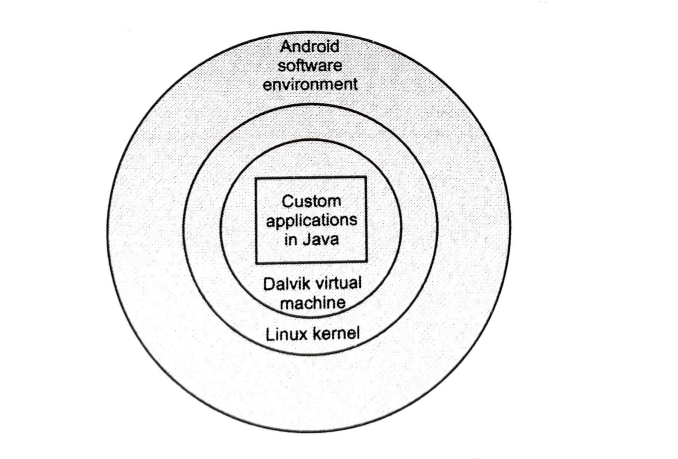
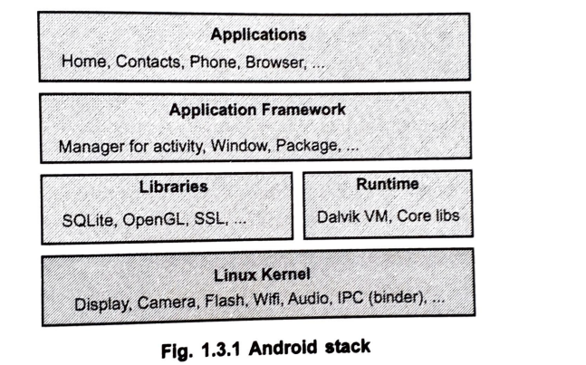

# **1 Overview of Android**

## **1.1 Introduction to Android**

=> **Definition**: `Android is an open-source operating system and software development platform used to build mobile applications.`

=> Android is mainly designed for smartphones, tablets, TV, watches and other smart devices.

=> It is based on the Linux kernel and provides a complete software stack for mobile application development.

### Android software stack

1. **Operating System**

=> Linux kernel provides low-level services such as memory management, process management, security, networking and hardware drivers.

2. **Middleware / Runtime**

=> Android runtime executes Android applications.

=> Older Android versions used Dalvik Virtual Machine. Modern Android uses ART.

3. **Application Framework**

=> Provides high-level APIs such as Activity Manager, Content Provider, Resource Manager, View System and Notification Manager.

4. **Applications**

=> Built-in and user-installed applications such as Phone, SMS, Contacts, Camera, Browser and third-party apps.



## **1.2 Features of Android**

### Important features

1. **Open source**

=> Android source code is open, so developers and device manufacturers can customize it.

2. **Linux-based**

=> Android uses Linux kernel for security, memory management, process management and device drivers.

3. **Rich application framework**

=> Provides reusable APIs for UI, storage, media, telephony, location, sensors and notifications.

4. **Multitasking**

=> Android supports multiple applications and background services.

5. **Media support**

=> Supports audio/video formats such as MP3, MP4, 3GP, AAC, MIDI and image formats like JPEG and PNG.

6. **SQLite database**

=> Provides built-in lightweight database support for structured local data.

7. **Connectivity**

=> Supports Wi-Fi, Bluetooth, GSM, EDGE, 3G, 4G, 5G and NFC depending on device hardware.

8. **Web browser support**

=> Provides WebKit/Chromium-based web support and `WebView`.

9. **Sensor support**

=> Supports GPS, accelerometer, gyroscope, compass, proximity and other sensors.

10. **Better notification system**

=> Android provides notifications to alert users about events from apps.

## **1.3 Advantages and Disadvantages of Android**

### Advantages

1. Open-source platform.
2. Large developer community.
3. Supports many hardware devices.
4. Easy app distribution through Play Store.
5. Rich APIs for camera, location, sensors, media and database.
6. Supports multitasking and background services.
7. Built-in SQLite database support.
8. Customizable user interface.

### Disadvantages

1. Device fragmentation due to many screen sizes and Android versions.
2. Battery consumption can be high for background apps and location services.
3. Security risk if apps are installed from unknown sources.
4. Performance may vary across low-end and high-end devices.
5. Testing is difficult because many device configurations exist.

## **1.4 Android APIs**

=> Android APIs are packages and classes used to develop Android applications.

### Important Android API packages

1. `android.app`

=> Provides classes for Activity, Service, Dialog and application model.

2. `android.os`

=> Provides operating system services such as Bundle, Handler, Message and system clock.

3. `android.view`

=> Provides UI building blocks such as View, ViewGroup and event handling.

4. `android.widget`

=> Provides ready-made UI controls such as TextView, EditText, Button, ListView and Spinner.

5. `android.content`

=> Provides Intent, Context, BroadcastReceiver and ContentResolver.

6. `android.database`

=> Provides database classes such as Cursor.

7. `android.database.sqlite`

=> Provides SQLite database support.

8. `android.graphics`

=> Provides graphics classes such as Canvas, Paint, Bitmap and Color.

9. `android.media`

=> Provides media playback and recording classes like MediaPlayer and MediaRecorder.

10. `android.location`

=> Provides location-related classes.

11. `android.provider`

=> Provides access to system content providers like Contacts and MediaStore.

12. `android.webkit`

=> Provides WebView for displaying web content inside Android apps.

## **1.5 Android Architecture**

=> Android architecture is a layered software stack.



### Block diagram

```text
+----------------------------------+
|          Applications             |
| Phone, SMS, Contacts, Browser     |
+----------------------------------+
|      Application Framework        |
| Activity Manager, View System,    |
| Resource Manager, Content         |
| Providers, Notification Manager   |
+----------------------------------+
| Android Runtime + Native Libraries|
| ART/DVM, Core Libraries, SQLite,  |
| WebKit, OpenGL ES, Media Library  |
+----------------------------------+
|            Linux Kernel           |
| Drivers, Memory, Process, Power,  |
| Security, Network Stack           |
+----------------------------------+
```

### 1. Linux Kernel Layer

=> It is the bottom layer of Android architecture.

### Functions

1. Hardware abstraction.
2. Memory management.
3. Process management.
4. Device drivers.
5. Security.
6. Power management.
7. Network stack.

### 2. Native Libraries and Android Runtime

=> Native libraries are written mainly in C/C++.

### Examples

1. SQLite for database.
2. WebKit/Chromium for web support.
3. OpenGL ES for graphics.
4. Media libraries for audio/video.
5. SSL libraries for secure communication.

=> Android Runtime executes Android applications.

=> Older Android versions used DVM. Modern Android uses ART.

### 3. Application Framework Layer

=> Provides high-level services to app developers.

### Important managers

1. Activity Manager.
2. Window Manager.
3. Resource Manager.
4. Content Providers.
5. Notification Manager.
6. View System.
7. Location Manager.
8. Package Manager.

### 4. Application Layer

=> Top layer of Android architecture.

=> Contains system apps and user-installed apps.

### Examples

1. Phone.
2. SMS.
3. Contacts.
4. Camera.
5. Browser.
6. Third-party apps.

## **1.6 Android Application Framework**

=> **Definition**: `Android Application Framework provides reusable classes and services used to build Android applications.`

### Main framework components

1. **Activity Manager**

=> Manages Activity lifecycle and back stack.

2. **Window Manager**

=> Manages windows and screen display.

3. **View System**

=> Provides UI components such as Button, TextView, layouts and event handling.

4. **Resource Manager**

=> Provides access to non-code resources like strings, images, colors and layouts.

5. **Content Providers**

=> Allows apps to share data securely.

6. **Notification Manager**

=> Allows apps to show notifications to users.

7. **Package Manager**

=> Provides information about installed applications and permissions.

8. **Location Manager**

=> Provides location-based services.

## **1.7 Android Application Components**

=> Application components are the building blocks of Android applications.

### Main components

1. **Activity**

=> Represents a single screen with user interface.

=> Example: Login screen, home screen, registration screen.

2. **Service**

=> Performs background work without user interface.

=> Example: Music playback, file download, data sync.

3. **Broadcast Receiver**

=> Receives broadcast messages from Android system or other applications.

=> Example: Battery low, boot completed, network changed.

4. **Content Provider**

=> Manages and shares application data with other applications.

=> Example: Contacts provider.

### Component summary

| Component | Main use |
|---|---|
| Activity | UI screen |
| Service | Background task |
| BroadcastReceiver | Receive events |
| ContentProvider | Share data |

## **1.8 AndroidManifest.xml**

=> **Definition**: `AndroidManifest.xml is a configuration file that gives essential information about the app to the Android system.`

=> Every Android application must have a manifest file.

### Uses

1. Declares app package name.
2. Declares activities, services, receivers and providers.
3. Declares permissions required by the app.
4. Declares launcher Activity.
5. Defines minimum SDK and app features.
6. Declares intent filters.
7. Defines application theme, icon and label.

### Example

```xml
<manifest xmlns:android="http://schemas.android.com/apk/res/android">

    <uses-permission android:name="android.permission.INTERNET" />

    <application
        android:label="@string/app_name"
        android:theme="@style/AppTheme">

        <activity
            android:name=".MainActivity"
            android:exported="true">
            <intent-filter>
                <action android:name="android.intent.action.MAIN" />
                <category android:name="android.intent.category.LAUNCHER" />
            </intent-filter>
        </activity>

        <service android:name=".MyService" />
        <receiver android:name=".MyReceiver" />

    </application>
</manifest>
```

## **1.9 Android Development Environment**

=> Android applications are commonly developed using Android Studio.

### Required tools

1. **JDK**

=> Java Development Kit required for Java-based Android development.

2. **Android Studio**

=> Official IDE for Android development.

3. **Android SDK**

=> Contains Android platform APIs and tools.

4. **Gradle**

=> Build system used to compile and package Android applications.

5. **Emulator / AVD**

=> Used to test apps on virtual Android devices.

### Older tools

=> Eclipse with ADT plugin was used earlier for Android development.

=> Modern Android development mostly uses Android Studio.

## **1.10 Android Developing Tools**

### Android SDK

=> Android SDK contains tools, libraries, emulator and APIs needed for Android development.

### Android Studio

=> Official IDE used to create, build, run, debug and publish Android apps.

### ADB

=> **ADB** stands for Android Debug Bridge.

=> It connects a computer to an emulator or physical Android device.

### Uses of ADB

1. Install APK.
2. Debug app.
3. View logs.
4. Copy files.
5. Run shell commands on device.

### Common ADB commands

```text
adb devices
adb install app-debug.apk
adb logcat
adb shell
```

### Emulator

=> Emulator runs a virtual Android device on the computer.

=> It helps test apps without a physical device.

## **1.11 Dalvik Virtual Machine (DVM)**

=> **Definition**: `Dalvik Virtual Machine is the virtual machine traditionally used by Android to execute Dalvik bytecode.`

=> Android apps written in Java are compiled into `.class` files and then converted into `.dex` files.

=> DVM executes `.dex` files.

### Features of DVM

1. Optimized for low memory mobile devices.
2. Register-based virtual machine.
3. Runs each app in a separate process.
4. Provides app isolation and security.
5. Supports multiple instances for multiple apps.

### Java to APK process

```text
Java source code
      |
      v
.class files
      |
      v
.dex file
      |
      v
APK file
      |
      v
Installed on device
```

## **1.12 Android Runtime (ART)**

=> **ART** stands for Android Runtime.

=> ART replaced Dalvik as the default runtime in modern Android.

### Features

1. Uses Ahead-of-Time and Just-in-Time compilation.
2. Improves app performance.
3. Reduces app startup time.
4. Provides improved garbage collection.
5. Reduces UI freezing caused by memory cleanup.

### DVM vs ART

| DVM | ART |
|---|---|
| Older runtime. | Modern Android runtime. |
| Executes Dalvik bytecode. | Compiles bytecode more efficiently. |
| More runtime interpretation. | Better performance and garbage collection. |

## **1.13 Building an Android Application**

=> Android build tools convert source code and resources into an installable app package.

### Build process

1. Java/Kotlin source code is compiled.
2. Compiled classes are converted into DEX bytecode.
3. XML layouts, images and resources are packaged.
4. Manifest is merged and processed.
5. DEX files and resources are packaged into APK/AAB.
6. App is signed.
7. APK/AAB is installed or published.

### Important build files

1. `AndroidManifest.xml`: App configuration.
2. `build.gradle`: Build configuration.
3. `res/layout`: UI layout files.
4. `res/values`: Strings, colors, styles.
5. `java` or `kotlin` folder: Application source code.

## **1.14 Android SDK Features**

### Features

1. No licensing fee for development.
2. Full multimedia support.
3. Sensor hardware APIs.
4. Location-based service APIs.
5. Inter-process communication support.
6. Shared data storage.
7. Background services.
8. Widgets and notifications.
9. WebView browser support.
10. Telephony and networking APIs.
11. Emulator and debugging tools.

## **1.15 Exam Short Questions**

=> **Question**: `Define Android.`

=> **Answer**: Android is an open-source Linux-based operating system and development platform used to build mobile applications.

=> **Question**: `List Android application components.`

=> **Answer**: Activity, Service, BroadcastReceiver and ContentProvider.

=> **Question**: `What is ADB?`

=> **Answer**: ADB stands for Android Debug Bridge. It is used to communicate with emulator or physical device for debugging and installation.

=> **Question**: `What is AndroidManifest.xml?`

=> **Answer**: It is the configuration file that declares app components, permissions, launcher activity and other app information.

=> **Question**: `What is DVM?`

=> **Answer**: DVM is Dalvik Virtual Machine, used by older Android versions to execute `.dex` bytecode.

=> **Question**: `What is Resource Manager?`

=> **Answer**: Resource Manager provides access to non-code resources such as strings, layouts, colors and images.
