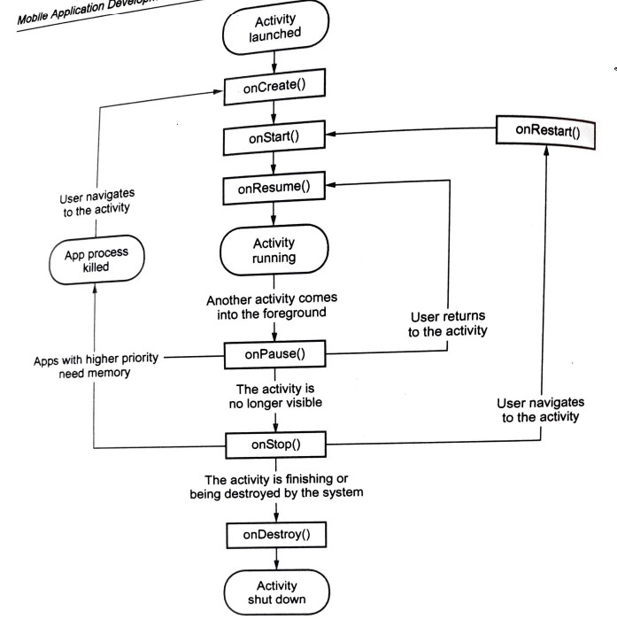
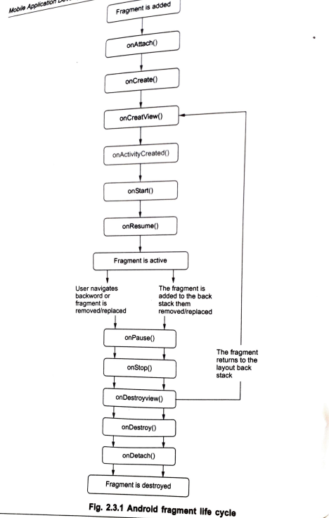

# **2 Activities, Fragments, Intents and AVD**

## **2.1 Activity**

=> **Definition**: `An Activity is an Android application component that represents a single screen with a user interface.`

=> Example: Login screen, registration screen, home screen and settings screen.

=> An Android app can contain one or more activities.

### Simple Activity example

```java
public class MainActivity extends AppCompatActivity {
    @Override
    protected void onCreate(Bundle savedInstanceState) {
        super.onCreate(savedInstanceState);
        setContentView(R.layout.activity_main);
    }
}
```

### Activity declaration in manifest

```xml
<activity
    android:name=".MainActivity"
    android:exported="true">
    <intent-filter>
        <action android:name="android.intent.action.MAIN" />
        <category android:name="android.intent.category.LAUNCHER" />
    </intent-filter>
</activity>
```

## **2.2 Activity Lifecycle**

=> **Definition**: `Activity lifecycle is the set of states through which an Activity passes from creation to destruction.`

=> Android calls lifecycle methods automatically according to user actions and system events.



### Diagram

```text
Activity launched
      |
      v
  onCreate()
      |
      v
  onStart()
      |
      v
  onResume()
      |
      v
Activity running
      |
      v
  onPause()
   /      \
  v        v
onResume() onStop()
             |
             v
        onRestart()
             |
             v
          onStart()

Finish activity:
onPause() -> onStop() -> onDestroy()
```

### Lifecycle methods

1. **onCreate()**

=> Called when Activity is first created.

=> Used to initialize variables and set layout using `setContentView()`.

2. **onStart()**

=> Called when Activity becomes visible.

3. **onResume()**

=> Called when Activity starts interacting with user.

4. **onPause()**

=> Called when Activity loses focus.

=> Used to pause animations, sensors or camera preview.

5. **onStop()**

=> Called when Activity is no longer visible.

6. **onRestart()**

=> Called when stopped Activity starts again.

7. **onDestroy()**

=> Called before Activity is destroyed.

### Lifecycle code example

```java
public class MainActivity extends AppCompatActivity {
    @Override protected void onCreate(Bundle b) {
        super.onCreate(b);
        setContentView(R.layout.activity_main);
    }

    @Override protected void onStart() { super.onStart(); }
    @Override protected void onResume() { super.onResume(); }
    @Override protected void onPause() { super.onPause(); }
    @Override protected void onStop() { super.onStop(); }
    @Override protected void onRestart() { super.onRestart(); }
    @Override protected void onDestroy() { super.onDestroy(); }
}
```

## **2.3 Bundle**

=> **Bundle** is a key-value data structure used to pass and save data in Android.

### Uses

1. Pass data between activities.
2. Save temporary state during configuration changes.
3. Receive data in lifecycle methods.
4. Store values like String, int, boolean and arrays.

### Example

```java
Intent intent = new Intent(this, SecondActivity.class);
Bundle bundle = new Bundle();
bundle.putString("name", "Aman");
bundle.putInt("age", 20);
intent.putExtras(bundle);
startActivity(intent);
```

Receive data:

```java
Bundle bundle = getIntent().getExtras();
String name = bundle.getString("name");
int age = bundle.getInt("age");
```

## **2.4 Screen Orientation and State Handling**

=> Android normally destroys and recreates Activity when screen orientation changes.

=> This allows Android to load resources suitable for portrait or landscape mode.

### Provide different layouts

Portrait:

```text
res/layout/activity_main.xml
```

Landscape:

```text
res/layout-land/activity_main.xml
```

### Save state

```java
@Override
protected void onSaveInstanceState(Bundle outState) {
    super.onSaveInstanceState(outState);
    outState.putString("username", "Aman");
}
```

### Restore state

```java
if (savedInstanceState != null) {
    String username = savedInstanceState.getString("username");
}
```

### Fix orientation

```xml
<activity
    android:name=".MainActivity"
    android:screenOrientation="portrait" />
```

## **2.5 Fragment**

=> **Definition**: `A Fragment is a reusable portion of an Activity UI and behavior.`

=> A Fragment must be hosted inside an Activity.

=> It has its own lifecycle and can be added, removed or replaced while the Activity is running.

### Advantages of fragments

1. Reuse UI and logic in multiple screens.
2. Create flexible UI for phones and tablets.
3. Support different layouts for portrait and landscape.
4. Add, remove or replace UI parts dynamically.
5. Support back stack navigation.

### Fragment example

```java
public class HomeFragment extends Fragment {
    @Override
    public View onCreateView(LayoutInflater inflater,
                             ViewGroup container,
                             Bundle savedInstanceState) {
        return inflater.inflate(R.layout.fragment_home, container, false);
    }
}
```

### Fragment layout container

```xml
<FrameLayout
    android:id="@+id/container"
    android:layout_width="match_parent"
    android:layout_height="match_parent" />
```

### Add or replace fragment

```java
getSupportFragmentManager()
        .beginTransaction()
        .replace(R.id.container, new HomeFragment())
        .commit();
```

## **2.6 Fragment Lifecycle**

=> Fragment lifecycle is affected by the lifecycle of its host Activity.



### Lifecycle methods

1. `onAttach()`: Fragment is attached to Activity.
2. `onCreate()`: Fragment is initialized.
3. `onCreateView()`: Fragment UI is created.
4. `onViewCreated()`: Called after fragment view is created.
5. `onStart()`: Fragment becomes visible.
6. `onResume()`: Fragment becomes interactive.
7. `onPause()`: Fragment is no longer interactive.
8. `onStop()`: Fragment is no longer visible.
9. `onDestroyView()`: Fragment view is destroyed.
10. `onDestroy()`: Fragment object is destroyed.
11. `onDetach()`: Fragment is detached from Activity.

### Fragment lifecycle diagram

```text
onAttach()
   |
onCreate()
   |
onCreateView()
   |
onViewCreated()
   |
onStart()
   |
onResume()
   |
onPause()
   |
onStop()
   |
onDestroyView()
   |
onDestroy()
   |
onDetach()
```

## **2.7 Communication between Fragment and Activity**

### Fragment can access Activity

```java
MainActivity activity = (MainActivity) getActivity();
```

### Activity can access Fragment

```java
HomeFragment fragment =
        (HomeFragment) getSupportFragmentManager()
                .findFragmentById(R.id.container);
```

### Recommended simple approach

=> Use interface callbacks when Fragment needs to send data to Activity.

```java
public interface OnMessageSendListener {
    void onMessageSend(String message);
}
```

## **2.8 Replacing Fragment and Back Stack**

=> Fragment can be added, replaced or removed using `FragmentTransaction`.

=> `addToBackStack()` allows the user to return to the previous fragment using Back button.

### Example

```java
getSupportFragmentManager()
        .beginTransaction()
        .replace(R.id.container, new DetailFragment())
        .addToBackStack(null)
        .commit();
```

=> If transaction is not added to back stack, the replaced fragment is destroyed and user cannot return to it using Back button.

## **2.9 Intent**

=> **Definition**: `Intent is a messaging object used to request an action from another Android component.`

### Uses of Intent

1. Start an Activity.
2. Start a Service.
3. Send a Broadcast.
4. Pass data between components.
5. Open system apps such as browser, dialer, camera and map.

## **2.10 Explicit Intent**

=> Explicit Intent specifies the exact target component.

=> It is mostly used to navigate between activities in the same app.

### Example

```java
Intent intent = new Intent(MainActivity.this, SecondActivity.class);
intent.putExtra("username", "Aman");
startActivity(intent);
```

Receive in `SecondActivity`:

```java
String username = getIntent().getStringExtra("username");
```

## **2.11 Implicit Intent**

=> Implicit Intent does not specify the exact target component.

=> It specifies only an action. Android finds a suitable app to handle that action.

### Open dialer

```java
Intent intent = new Intent(Intent.ACTION_DIAL);
intent.setData(Uri.parse("tel:9876543210"));
startActivity(intent);
```

### Open browser

```java
Intent intent = new Intent(Intent.ACTION_VIEW);
intent.setData(Uri.parse("https://www.google.com"));
startActivity(intent);
```

### Difference between explicit and implicit intent

| Explicit Intent | Implicit Intent |
|---|---|
| Target component is specified. | Target component is not specified. |
| Mostly used inside same app. | Used to call system or other apps. |
| Example: Open `SecondActivity`. | Example: Open browser/dialer. |

## **2.12 Intent Filter**

=> **Definition**: `Intent filter declares the type of intents an Android component can receive.`

=> It is written in `AndroidManifest.xml`.

### Uses

1. Defines launcher Activity.
2. Allows components to respond to implicit intents.
3. Specifies action, category and data accepted by a component.

### Launcher Activity example

```xml
<activity android:name=".MainActivity">
    <intent-filter>
        <action android:name="android.intent.action.MAIN" />
        <category android:name="android.intent.category.LAUNCHER" />
    </intent-filter>
</activity>
```

## **2.13 Broadcast using Intent**

=> Intent can be used to send broadcast messages.

=> BroadcastReceiver receives the broadcast and performs required action.

### Send broadcast

```java
Intent intent = new Intent("com.example.MY_EVENT");
intent.putExtra("message", "Hello Receiver");
sendBroadcast(intent);
```

### BroadcastReceiver

```java
public class MyReceiver extends BroadcastReceiver {
    @Override
    public void onReceive(Context context, Intent intent) {
        String msg = intent.getStringExtra("message");
        Toast.makeText(context, msg, Toast.LENGTH_SHORT).show();
    }
}
```

### Manifest

```xml
<receiver android:name=".MyReceiver">
    <intent-filter>
        <action android:name="com.example.MY_EVENT" />
    </intent-filter>
</receiver>
```

## **2.14 Android Virtual Device (AVD)**

=> **Definition**: `Android Virtual Device is a configuration that defines a virtual Android device for testing apps in an emulator.`

### AVD contains

1. Hardware profile.
2. System image.
3. Android version.
4. Screen size and resolution.
5. Storage area.
6. Device skin.

### Uses

1. Test app without physical device.
2. Test different screen sizes.
3. Test different Android versions.
4. Debug app using emulator.

### Steps to create AVD in Android Studio

1. Open Android Studio.
2. Go to **Tools -> Device Manager**.
3. Click **Create Device**.
4. Select hardware profile.
5. Select or download system image.
6. Configure device name and settings.
7. Click **Finish**.
8. Start emulator using Play button.

## **2.15 Mapping Application to Process**

=> Android build tools convert source files and resources into an installable app package.

### Process

```text
Java/Kotlin source code
        |
        v
Compiled class files
        |
        v
DEX bytecode
        |
        v
Resources + Manifest packaged
        |
        v
APK/AAB generated
        |
        v
Installed on device using ADB or Play Store
```

### Important tools

1. Java/Kotlin compiler.
2. D8/R8 compiler for DEX and optimization.
3. AAPT for resource packaging.
4. Gradle for build automation.
5. ADB for installing and debugging.

## **2.16 Exam Short Questions**

=> **Question**: `What is Activity?`

=> **Answer**: Activity is an Android component that represents one screen with a user interface.

=> **Question**: `What is Fragment?`

=> **Answer**: Fragment is a reusable part of Activity UI with its own lifecycle.

=> **Question**: `What is Intent?`

=> **Answer**: Intent is a messaging object used to request an action from another component.

=> **Question**: `What is AVD?`

=> **Answer**: AVD is Android Virtual Device, used to test apps on an emulator.

=> **Question**: `What is Bundle?`

=> **Answer**: Bundle is a key-value structure used to pass or save data.

=> **Question**: `Why use addToBackStack()?`

=> **Answer**: It allows the user to return to the previous fragment using Back button.
